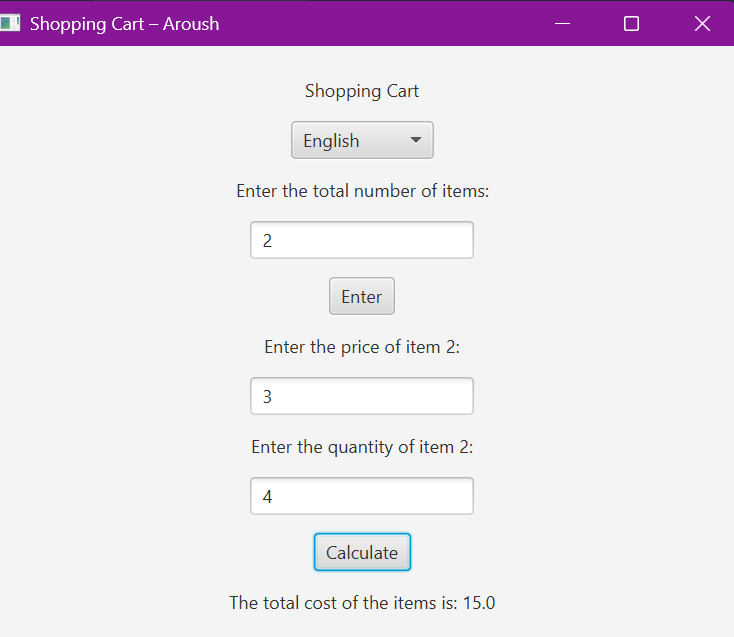
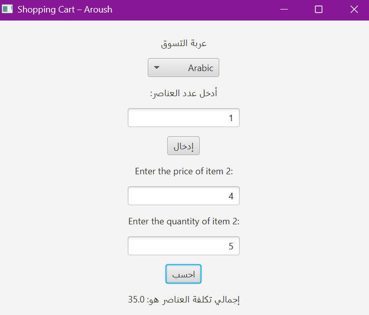
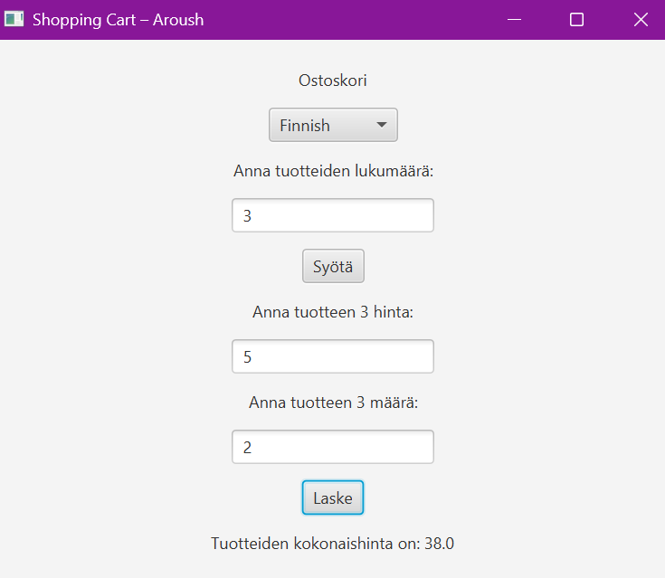
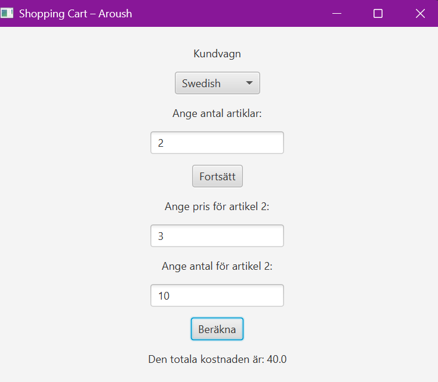
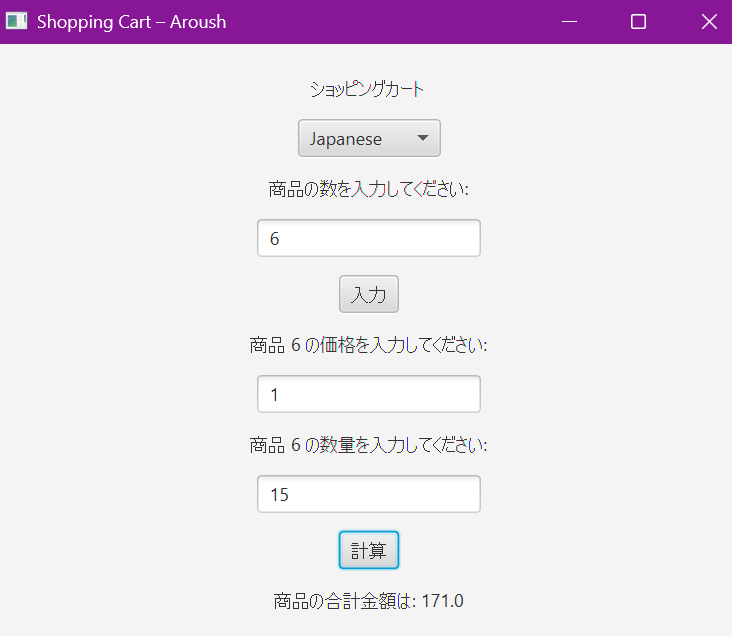
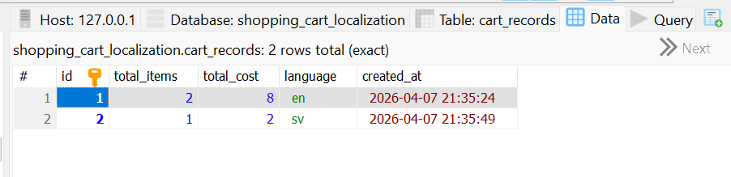
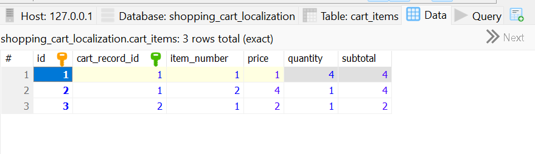

# Localized UI

A simple JavaFX application that displays a multilingual shopping cart interface.  
The user enters the number of items, then the price and quantity for each item, and the app calculates the total cost.  
The UI supports multiple languages including **English, Arabic, Finnish, Swedish, and Japanese**.

---

## Setup Instructions (Minimal)

1. Clone the repository:
```bash
git clone "https://github.com/aroushirfan/sep2-w3-assignment.git"
```
2. Create the database using the SQL file `database.sql`
3. Update the database connection details in `DatabaseConnection.java`
4. Run the application
```bash
mvn javafx:run
```
## Screenshots
### **GUI in English**

### **GUI in Arabic**

### **GUI in Finnish**
 
### **GUI in Swedish**
 
### **GUI in Japanese**
  
### **cart_records table**
  

### **cart_items table**

